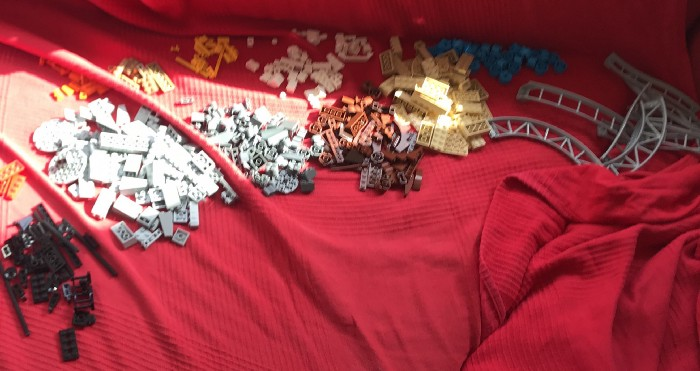

An introduction.

> You can also [read the post on Medium](https://medium.com/@catnipunicorn/hello-my-name-is-anna-and-i-am-autistic-583b02f67047).

## Hello, my name is Anna and I am autistic.
If you look at me, if you work with me, if you sometimes drink or socially interact with me — you might not suspect a thing. I have the appearance of an Adult Who Has Her Shit together: well-paying job, great boyfriend, holidays all over the world, two cats, serious hobbies like opera. I speak three languages, I have a cum laude University diploma (in addition to an impeccable high school one), I have moved to a different country and started my professional life from scratch, basically achieving quiet a lot in four years.

Amazing, right? I am a great and my life is wonderful. Unless you are aware about my crying in the office toilet, panic attacks caused by loud background noise, general misery and constant anxiety, inability to perceive what people imply with their words, bad temper, and, of course, a mild but chronic depression as a result of it all.

I have been getting professional mental health help for two years now, but only this summer I have been officially diagnosed with autistic spectrum disorder (Asperger's syndrome is not an official diagnosis anymore — since 2013). I want to tell the world what it is like for me — what does it mean — why I am happy with the diagnosis — and how you all can help me and people like me. Moreover, I just want to write it all down to cope better myself as writing was always an activity that made feel better.

> Along with building Lego and doing some other things.

(I also write in Russian in my [telegram channel](https://t.me/joinchat/AAAAAD6x1kjy32pDI3nOug)).
